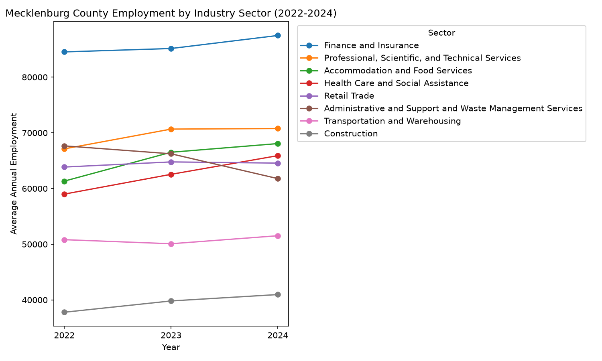
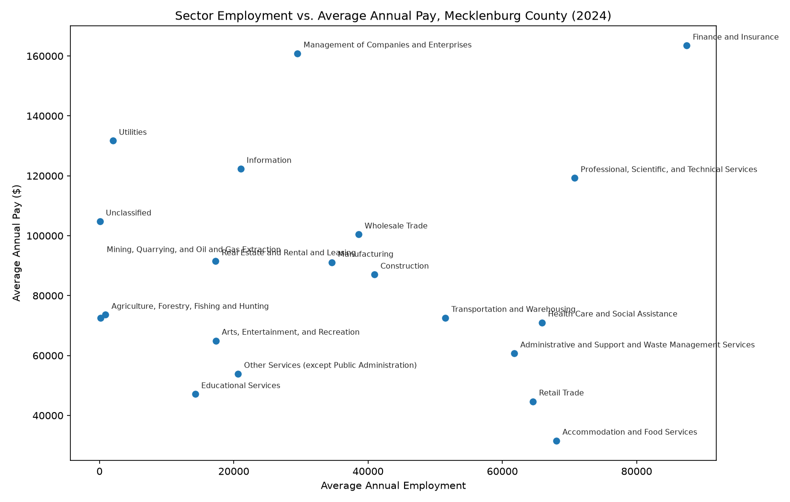

# Projects
This section documents my data science projects, research questions, and data stories I create throughout the semesters.
---
## Project 1
## Charlotte Small Business Impact of NC SB 257

Exploratory data analysis of how NC Senate Bill 257 (2026 Appropriations Act)
exposes different industries in Mecklenburg County, NC.

### Visualizations

Finance and Insurance is consistently the largest private-sector employer
among Mecklenburg County's major industries and grew across 2022–2024,
consistent with Charlotte's role as a regional banking hub. Professional,
Scientific, and Technical Services grew sharply between 2022 and 2023
before leveling off. Administrative and Support and Waste Management
Services is the only major sector to decline over the period.

Comparing pay against employment by sector for 2024 shows wage
polarization: high-pay/low-employment sectors (Management of Companies,
Utilities, Information) versus high-employment/lower-pay sectors
(Accommodation and Food Services, Retail Trade). Finance and Insurance
is the exception, ranking high on both.

*(Fill in: Data Description, Cleaning steps, Ethics/Limitations, and your
SB 257 provision-tier findings once you've read the bill sections — see
earlier in this chat for the full section-by-section draft.)*

## Carowinds Relational Database Design

Designed and implemented an Oracle SQL relational database themed around
Carowinds theme park operations, as part of a database design course
team project.

